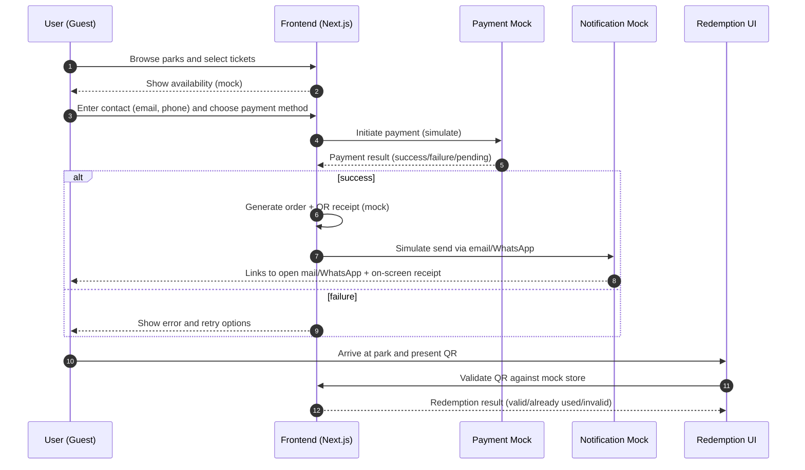
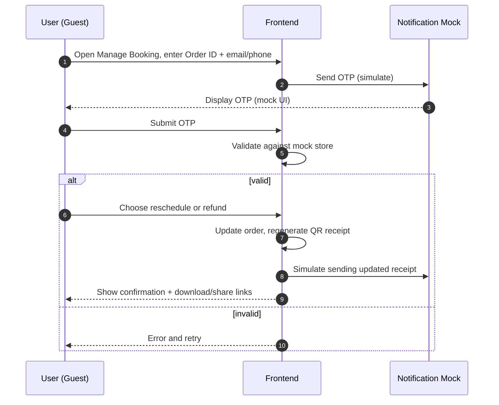
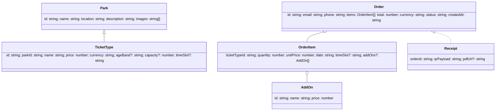
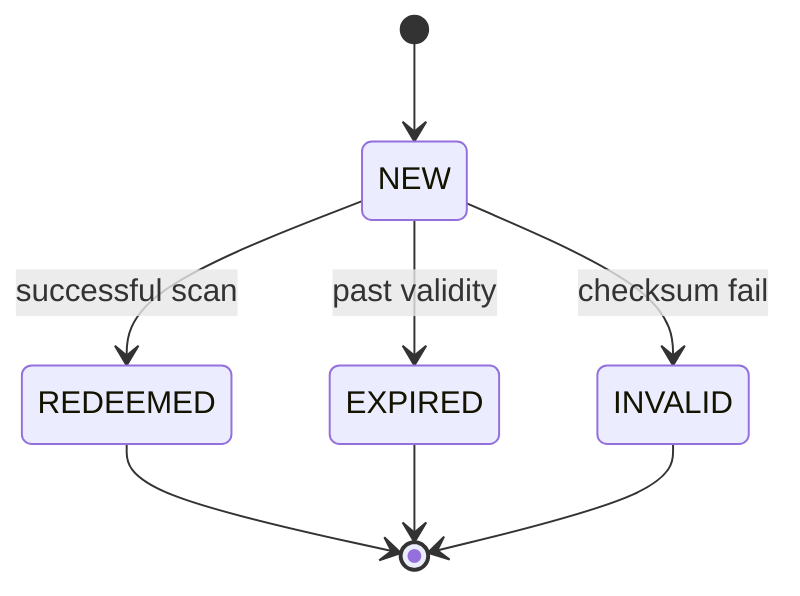

# BRD — Online Park Ticket Booking (Frontend Only: Next.js + TypeScript, Mock Data)

> **Document status:** Draft v1.0 (Frontend-only scope).
>
> **Tech context:** Next.js (App Router) + TypeScript with mock data/services only. No real backend or integrations.

---

## 1) Purpose and Audience
**Business goal.** Enable guests to browse parks and purchase tickets without authentication, receive a QR-code receipt via email/WhatsApp (simulated), and redeem on-site with a validator screen. The app must support mobile-first usage with accessible UI and deterministic mock flows for testing.

**Audience.** Product, Engineering, Design, QA, and business stakeholders.

---

## 2) Scope
**In-scope.**
- Guest browsing and discovery of parks (search/filter/sort).
- Ticket selection, cart, and checkout.
- Payment simulation (success/failure/pending with configurable outcomes).
- Receipt generation with QR code (client-side), downloadable PDF.
- Simulated delivery via `mailto:` and WhatsApp deep links; on-screen copies.
- Redemption UI (validator) to validate/consume QR against mock store.
- Self-service after-sales (Flow 2): reschedule/refund with OTP (simulated).
- Accessibility (WCAG 2.1 AA targets where applicable), basic analytics events, and mock APIs/data.

**Out-of-scope.**
- Real payments, real email/WhatsApp sending, real backend services.
- On-site scanning hardware integration.
- Full admin CMS, authentication/registration, role-based admin tools.

---

## 3) Assumptions and Design Rationale (brief)
- Marketplace-style browsing of multiple parks, dates, and ticket types.
- No authentication; orders are retrieved by **order ID + contact** (email or phone).
- Payment is simulated with toggles (UI control and/or query params) to force **success/failure/pending**; pending can later be resolved.
- Receipts are generated client-side; delivery is simulated via **mailto** and **WhatsApp** deep links plus a downloadable **PDF** copy.
- QR encodes a **signed payload** (mock HMAC) for tamper checking. Redemption validation is client-simulated against a mock store.
- Defaults: **English** locale, **USD** currency, **park-local timezone** on date/time displays.
- Mobile-first responsive UI; target WCAG 2.1 AA for forms, color contrast, and navigation.

---

## 4) Stakeholders
- **Guest Users** (customers purchasing tickets)
- **Park Operations** (on-site staff redeeming/validating)
- **Product Manager** (scope, prioritization)
- **Engineering** (frontend implementation, mock services)
- **Design** (information architecture, UI/UX)
- **QA** (test plans and execution)

---

## 5) User Personas
- **Guest Solo Visitor.** Prioritizes speed; minimal required fields; uses mobile.
- **Family/Group Organizer.** Buys multiple tickets and add-ons; requires clear summaries, rescheduling support.
- **Operations Staff.** Needs fast, reliable redemption with clear pass/fail feedback.

---

## 6) Key User Flows
- **Flow 1:** Guest browse → select tickets → provide contact → choose payment → **simulate** payment → receive receipt (QR) via email/WhatsApp → visit park → redeem.
- **Flow 2 (proposed):** Self-service reschedule/refund without login using order ID + one-time code (OTP) sent via email/SMS (mock); updates ticket validity and issues updated receipt/QR; invalidates old QR.

---

## 7) Flow 1 Details (Guest Booking)
### 7.1 Narrative
1. Guest lands on Home and discovers parks (list, search, filter).
2. Opens a Park Detail to review description, ticket types, pricing, and time slots.
3. Selects ticket quantities/add-ons and proceeds to Checkout.
4. Enters contact (email + phone), accepts terms, reviews summary.
5. Chooses a payment method and triggers **payment simulation**.
6. On success, the app generates an **Order** and **QR receipt**; shows confirmation with download/share options; simulates delivery via mail/WhatsApp links.
7. Guest visits the park and presents the QR. Operations staff validates using the Redemption UI, which checks the signed payload against the mock store and updates status.

### 7.2 Pages/Screens
- **Home / Parks List**
- **Park Detail**
- **Ticket Selection**
- **Cart / Checkout**
- **Payment (Simulated)**
- **Confirmation**
- **Receipt View / Download**
- **Redemption Info** (guest-facing) and **Redemption UI** (staff-facing validator)

### 7.3 Sequence Diagram (Mermaid)


### 7.4 Acceptance Criteria
- Checkout flows **must** work without login.
- System **must** generate a unique **order ID** and a **QR** embedding signed payload.
- Confirmation screen **must** provide: on-screen receipt, **download PDF**, and **share** via mail/WhatsApp deep links.
- Payment simulation **must** support success/failure/pending via UI toggle and/or query param.
- Failure cases **must** show actionable retry/cancel options and preserve form inputs.
- Redemption UI **must** mark orders as **REDEEMED** once validated and prevent reuse.
- All forms **must** include validation feedback, keyboard navigation, and ARIA labels.

### 7.5 Edge Cases & Errors
- Invalid/malformed email or phone; country code missing.
- Payment timeout (treat as **pending**), network offline (retry with exponential backoff for mock calls).
- Duplicate submissions (idempotent order creation guard on the client).
- Sold-out ticket types (capacity check at selection and at checkout confirm).
- QR reuse attempt, tampered payload (checksum mismatch), expired validity.

### 7.6 Test Scenarios (sample)
- Payment: success, failure, pending → later succeed/fail.
- Ticket mixes: adult/child pricing, add-ons, time slots, promo code applied.
- Accessibility: screen reader labels, focus traps, contrast, tab order, skip links.
- Error handling: offline mode, server 5xx (mock), invalid inputs.
- Redemption: valid QR → REDEEMED; second scan → already used; tampered QR → INVALID; past date → EXPIRED.

---

## 8) Flow 2 Details (Self-service Reschedule/Refund)
### 8.1 Narrative
1. User opens **Manage Booking** and enters order ID + contact (email/phone).
2. App triggers **OTP send** (mock) and displays the OTP in a safe mock banner/modal.
3. User enters OTP; app validates against mock store.
4. On success, user chooses **Reschedule** (new date/time slot) or **Refund** (subject to policy windows/fees).
5. App updates order, regenerates **QR receipt**, invalidates prior QR, and re-surfaces delivery links.

### 8.2 Pages/Screens
- Manage Booking Entry → OTP Verify → Change Options → Review Changes → Confirmation

### 8.3 Sequence Diagram (Mermaid)


### 8.4 Acceptance Criteria
- Modifications require **OTP** verification tied to order ID + contact.
- Policy windows enforced (e.g., reschedule ≥24h before entry; refunds ≤48h before entry, mock-configurable).
- New receipts **must** invalidate the old QR and reflect updated validity.
- Clear confirmations and error states throughout; actions must be reversible until final confirm.

### 8.5 Edge Cases & Errors
- Invalid or expired OTP; throttling after N attempts; resend with cooldown.
- Mixed-eligibility multi-ticket orders (e.g., some tickets past cutoff).
- Partial refunds and fee calculations; exchange rate rounding.

---

## 9) Functional Requirements
**Browsing & Discovery**
- List/search/filter parks by name, location, tags; sort by popularity/price AOV.
- Park Detail shows description, gallery, ticket types, time slots, capacity (mock), and policies.

**Ticketing**
- Quantity controls per ticket type; enforce capacity (mock) and age-based pricing (optional banding).
- Add-ons per park (e.g., locker, meal voucher) with pricing.
- Promo codes (mock) with %/fixed discount; validation and error messages.

**Checkout**
- Guest contact capture: email (RFC 5322 simplified) and phone (E.164) with country selector.
- Consent checkboxes (terms/privacy/marketing opt-in) with links.
- Order summary: items, quantities, dates, time slots, fees/taxes, discounts, grand total.

**Payments (Simulated)**
- Methods: Card, E-wallet, Bank Transfer (UI only).
- Outcome control: UI toggle (Success/Failure/Pending) and `?pm=success|failure|pending` query param.
- Pending can later be resolved by a **“Refresh Payment Status”** action.

**Receipts & QR**
- Unique order ID generation (UUID-like).
- QR payload includes: `orderId`, `checksum`, `issuedAt`, `itemsSummary`.
- PDF-like receipt downloadable from Confirmation and Manage pages.

**Notifications (Simulated)**
- Confirmation page provides **Open Mail** (mailto with subject/body) and **Open WhatsApp** (`https://wa.me/...` with prefilled text) buttons.
- A copy is stored in app state for re-download.

**Redemption**
- Staff-facing **validator** screen supports camera input (mock) or manual entry.
- Returns status: VALID → mark REDEEMED; ALREADY_USED; INVALID; EXPIRED.

**Manage Booking (Flow 2)**
- Lookup by Order ID + contact; OTP gate.
- Reschedule or Refund actions with preview and final confirm.

**Accessibility**
- Keyboard-navigable UI, focus states, ARIA labels, skip links, semantic landmarks, sufficient contrast.

---

## 10) Non-Functional Requirements
- **Performance.** LCP ≤ 3.0s on Fast 3G reference, TTI ≤ 5.0s; route-level code-splitting; image optimization; prefetch on idle.
- **Reliability.** Deterministic mock states; idempotent order creation (client guard using local txn token); retry/backoff for transient mock failures.
- **Privacy/Security.** Mask contacts in UI; do not persist PII beyond session in production demo; QR signed with mock secret (in code) purely for demonstration.
- **Compatibility.** Evergreen browsers (last 2 versions); responsive 320px+ breakpoints; touch and keyboard support.

---

## 11) Data Model
### 11.1 Mermaid Class Diagram


### 11.2 Sample Mock JSON
```json
{
  "parks": [
    {
      "id": "park_eco_001",
      "name": "Green Valley Eco-Park",
      "location": "Springfield, USA",
      "description": "Trails, canopy walks, and butterfly dome.",
      "images": ["/img/eco1.jpg", "/img/eco2.jpg"]
    },
    {
      "id": "park_amuse_001",
      "name": "Adventure Bay Amusement Park",
      "location": "Riverton, USA",
      "description": "Roller coasters and water rides.",
      "images": ["/img/amuse1.jpg", "/img/amuse2.jpg"]
    }
  ],
  "ticketTypes": [
    { "id": "tt_adult_day", "parkId": "park_eco_001", "name": "Adult Day Pass", "price": 35, "currency": "USD", "ageBand": "adult", "capacity": 500 },
    { "id": "tt_child_day", "parkId": "park_eco_001", "name": "Child Day Pass", "price": 20, "currency": "USD", "ageBand": "child", "capacity": 300 },
    { "id": "tt_combo_evening", "parkId": "park_amuse_001", "name": "Evening Combo", "price": 45, "currency": "USD", "timeSlot": "17:00-21:00", "capacity": 400 }
  ],
  "addOns": [
    { "id": "ao_meal", "name": "Meal Voucher", "price": 10 },
    { "id": "ao_locker", "name": "Locker Rental", "price": 5 }
  ],
  "orders": [
    {
      "id": "ord_20250101_0001",
      "email": "alex@example.com",
      "phone": "+15551230000",
      "items": [
        { "ticketTypeId": "tt_adult_day", "quantity": 2, "unitPrice": 35, "date": "2025-02-14" },
        { "ticketTypeId": "tt_child_day", "quantity": 1, "unitPrice": 20, "date": "2025-02-14", "addOns": [{ "id": "ao_meal", "name": "Meal Voucher", "price": 10 }] }
      ],
      "total": 100,
      "currency": "USD",
      "status": "PAID",
      "createdAt": "2025-01-01T10:00:00Z"
    }
  ],
  "receipts": [
    {
      "orderId": "ord_20250101_0001",
      "qrPayload": "eyJvcmRlcklkIjoib3JkXzIwMjUwMTAxXzAwMDEiLCJjaGVja3N1bSI6Ijg5N2FmZSIsImlzc3VlZEF0IjoiMjAyNS0wMS0wMVQxMDowMDowMFoiLCJpdGVtcyI6W3siYSI6InR0X2FkdWx0X2RheSIsInEiOjJ9LHsiYSI6InR0X2NoaWxkX2RheSIsInEiOjF9XX0"
    }
  ]
}
```

**Example QR payload (decoded JSON, illustrative):**
```json
{
  "orderId": "ord_20250101_0001",
  "checksum": "897afe",
  "issuedAt": "2025-01-01T10:00:00Z",
  "itemsSummary": [
    { "ticketTypeId": "tt_adult_day", "qty": 2 },
    { "ticketTypeId": "tt_child_day", "qty": 1 }
  ]
}
```

---

## 12) Mock APIs and Simulation
**Implementation approach.** In-frontend mock layer using static JSON + client-side stores; optionally MSW for intercepting `fetch` to `/mock/*` routes.

**Routes.**
- `GET /mock/parks`
- `GET /mock/parks/:id`
- `GET /mock/tickets?parkId=:id`
- `POST /mock/order`
- `POST /mock/payment/simulate` (body includes `outcome: "success"|"failure"|"pending"` or inferred from query param)
- `POST /mock/notify` (creates simulated mailto/wa.me strings)
- `POST /mock/manage/send-otp`
- `POST /mock/manage/verify-otp`
- `POST /mock/manage/update` (reschedule/refund)

**Schemas (concise TypeScript types).**
```ts
// Requests
type CreateOrderReq = {
  email: string; phone: string; items: { ticketTypeId: string; quantity: number; date: string; timeSlot?: string; addOnIds?: string[] }[];
  promoCode?: string;
};

type PaymentSimulateReq = { orderId: string; method: "card"|"ewallet"|"bank"; outcome?: "success"|"failure"|"pending" };

type SendOtpReq = { orderId: string; contact: { email?: string; phone?: string } };

type VerifyOtpReq = { orderId: string; otp: string };

type ManageUpdateReq = { orderId: string; action: "reschedule"|"refund"; payload: any };

// Responses
type ApiOk<T> = { ok: true; data: T };
interface ApiErr { ok: false; error: { code: string; message: string } }

type CreateOrderRes = { order: Order; receipt: Receipt };

type PaymentSimulateRes = { order: Order };

type SendOtpRes = { otpMasked: string; hint: string };

type VerifyOtpRes = { verified: boolean };

type ManageUpdateRes = { order: Order; receipt: Receipt };
```

**Status codes (mocked).** `200 OK` on success; `400` validation errors; `409` capacity conflict; `402` payment required/failed (simulated); `429` OTP throttling; `500` generic mock failure.

**Triggering outcomes.** UI toggle for payment result; or URL param `?pm=success|failure|pending`. OTP can be fixed (e.g., `123456`) or generated and displayed in mock banner for testability.

---

## 13) UI/UX Requirements
- **Navigation.** Header with Parks, Cart, Manage Booking; breadcrumb on detail/checkout.
- **Forms.** Client validation: email (simplified RFC 5322), phone (E.164), required consents; inline errors; disabled submit during processing.
- **Error & Empty States.** Clear messaging and actions (retry, back, contact support placeholder).
- **Mobile-first Layout.** Stacked sections, sticky order summary on small screens; touch-friendly controls.
- **Components.** Accessible dialogs, toasts, tabs, accordions; avoid hidden content traps; maintain focus on open/close.

---

## 14) QR and Redemption Spec
**QR content format.** `base64url(JSON({ orderId, checksum, issuedAt, itemsSummary }))`

**Checksum.** HMAC-SHA256 over `orderId + issuedAt` using a mock secret (stored in code). Example pseudocode:
```ts
const checksum = hmacSha256(mockSecret, `${orderId}|${issuedAt}`).slice(0, 12);
```

**Redemption states.** `NEW`, `REDEEMED`, `EXPIRED`, `INVALID`.

**State diagram (Mermaid).**


**Validator behavior.**
- On scan, decode base64url → parse JSON → recompute checksum.
- If checksum mismatch → `INVALID`.
- If date past validity window → `EXPIRED`.
- If first-time valid → mark as `REDEEMED` in mock store and display success.
- On repeat scan → display `ALREADY_USED` with timestamp of first redemption.

---

## 15) Policies
- **Reschedule cutoff:** ≥ 24 hours before entry time (configurable).
- **Refund cutoff:** ≤ 48 hours before entry time (configurable); fee may apply (flat or %).
- **Non-refundable items:** Certain add-ons can be flagged `nonRefundable: true`.
- **Partial refunds:** Allowed when subset of items is eligible; round to 2 decimals.

---

## 16) Analytics and KPIs
- **Funnel:** View → Add to Cart → Checkout Start → Payment Complete.
- **Metrics:** Conversion rate, drop-off per step, simulated delivery rate (receipt views/clicks), redemption rate, reschedule/refund rates.
- **Events (mock).** `park_view`, `ticket_add`, `checkout_begin`, `payment_result`, `receipt_download`, `qr_scanned`, `manage_update`.

---

## 17) Risks and Mitigations
- **Simulation vs reality gap.** Clearly label all flows as simulated; avoid implying production readiness for payments/notifications.
- **Privacy in demos.** Do not persist PII beyond session; mask contact on-screen.
- **QR forgery.** Use mock signature and validate; show disclaimers; do not leak secret.
- **Capacity inconsistencies.** Double-check capacity on confirm to simulate server-side checks; provide graceful sold-out fallback.

---

## 18) Milestones (Example)
- **M1:** Browsing and ticket selection.
- **M2:** Checkout + payment simulation.
- **M3:** Receipt/QR + share flow.
- **M4:** Redemption UI.
- **M5:** Manage Booking (Flow 2) + OTP simulation.
- **M6:** Accessibility and QA hardening.

---

## 19) Glossary
- **QR.** Quick Response code encoding structured payload.
- **OTP.** One-Time Password for verification.
- **Order ID.** Unique alphanumeric identifier for a purchase.
- **Time Slot.** Fixed visit window (e.g., 09:00–12:00) that constrains capacity.
- **Add-on.** Optional purchasable extra associated with a ticket/park.
- **Redemption.** On-site validation and consumption of a ticket’s entitlement.

---

## 20) Appendix
**Mermaid code blocks used:** See sections **7.3**, **8.3**, **11.1**, and **14** for the exact diagrams included in this BRD.

**Sample PDF/receipt template outline (textual):**
- Header: Park logo, park name, order ID, issuedAt.
- Purchaser: masked email/phone; QR code (large) with fallback code string.
- Items table: ticket name, date, time slot, qty, unit price, subtotal; add-ons listed beneath each item.
- Totals: subtotal, discounts, taxes/fees, grand total.
- Footnotes: terms, refund/reschedule policy, instructions for Manage Booking URL.
- Footer: “Demo only — payments/notifications simulated.”

